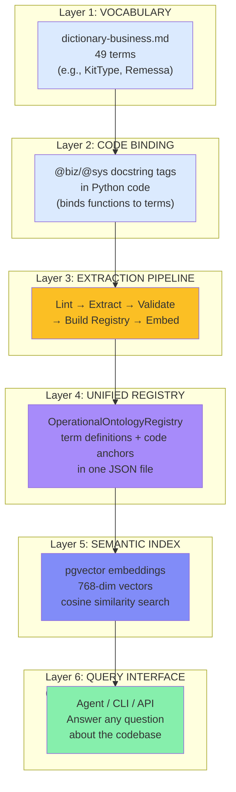
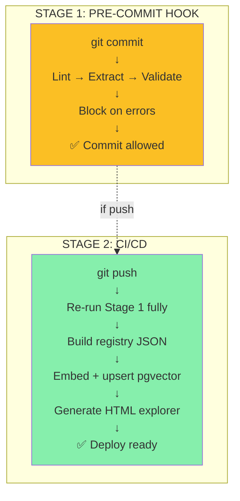

# Ontology System — Complete Overview

Welcome. This document is your **navigation hub** for the entire ontology system. It explains what the system does, how each piece fits together, and which document to read next.

---

## What Problem Does This Solve?

Every codebase develops its own language:

| Speaker | What They Call It |
|---------|-------------------|
| Business | "remessa" |
| Frontend Dev | `RemessaAquisicao` |
| Database | `remessa_aquisicao` |
| Slack thread | "the upload batch" |

Are they the same thing? Maybe. Nobody's sure. New engineers spend weeks learning vocabulary. Agents hallucinate terms. Business rules get implemented twice.

**This system closes that gap.** It creates a single source of truth: one dictionary, one registry, one index. And it makes it queryable.

---

## The System in 30 Seconds

```
Write two dictionaries (business + system vocabulary)
        ↓
Tag your code (@biz/@sys docstring annotations)
        ↓
Run the extraction pipeline (lint + scan + validate)
        ↓
Get a unified registry (JSON mapping terms to code)
        ↓
Embed it (pgvector semantic search)
        ↓
Answer questions: "How does kit matching work?"
```

---

## The Architecture Layers



---

## Reading Guide: Where to Start?

### **I want to understand the system**
→ Start here, then read:
1. `README.md` — Philosophy and getting started
2. `ARCHITECTURE_DIAGRAM.md` — Visual pipeline + components
3. `IMPLEMENTATION_STATUS.md` — What's done, what's pending

### **I want to write dictionaries and tag code**
→ Read:
1. `docs/USAGE.md` — 5-step developer guide
2. `docs/domain-tagging-constitution.md` — Full rules and schema
3. `docs/quick-reference.md` — One-page checklist

### **I want to query the ontology (answer questions)**
→ Read:
1. `QUERY_SYSTEM.md` — How to build a query engine
2. Choose your architecture (CLI / API / Agent-native)

### **I want to integrate with CI/CD**
→ Read:
1. `README.md` — Setup section
2. Check `.github/workflows/` for existing CI/CD

### **I'm debugging a tag validation error**
→ Read:
1. `CLAUDE.md` — Agent instructions (validation rules)
2. `docs/domain-tagging-constitution.md` — Schema rules
3. Run: `python -m semantic_index.cli validate --strict`

---

## Document Map

```
tools/semantic-index/
│
├── 📖 NAVIGATION & REFERENCE
│   ├── README.md ........................ Philosophy + Getting started
│   ├── OVERVIEW.md ..................... You are here (master nav)
│   ├── IMPLEMENTATION_STATUS.md ........ Inventory of what's done
│   ├── ARCHITECTURE_DIAGRAM.md ........ Visual pipeline
│   └── QUERY_SYSTEM.md ................ How to query + answer questions
│
├── 🛠️ DEVELOPER GUIDES
│   └── docs/
│       ├── USAGE.md ................... 5-step walkthrough
│       ├── domain-tagging-constitution.md ... Full rules (required read)
│       ├── quick-reference.md ......... One-page checklist
│       └── models-reference.md ....... Registry JSON schema
│
├── 👨‍💻 AGENT INSTRUCTIONS
│   ├── CLAUDE.md ...................... How Claude should approach tagging
│
├── ⚙️ IMPLEMENTATION
│   ├── cli.py ......................... 7 CLI commands (extract, validate, etc.)
│   ├── models.py ...................... Pydantic data models (the contract)
│   ├── taxonomy.py .................... 13-type vocabulary
│   ├── setup.py ....................... Database bootstrap
│   ├── extractors/
│   │   ├── tag_scanner.py ............ @biz/@sys tag extraction
│   │   ├── dictionary_extractor.py ... Markdown parsing
│   │   ├── dictionary_linter.py ...... Schema validation
│   │   └── event_validator.py ....... Event catalog validation
│   ├── registry/
│   │   └── builder.py ................ Registry merge + validate
│   ├── embeddings/
│   │   └── client.py ................. Gemini API + pgvector
│   └── examples/
│       └── example_tagged_module.py .. Reference implementation
│
└── ✅ TESTS (all passing)
    └── tests/
        ├── test_tag_scanner.py
        ├── test_dictionary_extractor.py
        ├── test_dictionary_linter.py
        ├── test_builder.py
        ├── test_embeddings.py
        ├── test_event_validator.py
        └── test_cli_integration.py
```

---

## How the Pieces Fit Together

### **Phase 1: Vocabulary Definition**
You write two Markdown files:
- `docs/vault/dictionary-business.md` — Business terms (e.g., "Remessa", "KitType")
- `docs/vault/dictionary-sys.md` — System terms (e.g., "EventLog", "State Machine")

**Your responsibility:** Prose descriptions, code equivalents, relationships (edges)

**Tools:** Your text editor + `docs/domain-tagging-constitution.md` as guide

---

### **Phase 2: Code Annotation**
You add `@biz` and `@sys` tags to Python docstrings:

```python
def evaluate_kit_completion(folder_docs, active_kits):
    """Evaluate a folder's documents against active KitTypes using OR logic.

    @biz: KitType | type: rule
    """
```

**Your responsibility:** Find business-relevant functions, tag them

**Tools:** Text editor + `docs/quick-reference.md` for syntax

---

### **Phase 3: Extraction Pipeline**
You (or CI) run the pipeline:

```bash
python -m semantic_index.cli extract      # Parse dicts + scan tags + build registry
python -m semantic_index.cli validate     # Check for errors
python -m semantic_index.cli report       # Show coverage %
```

**System responsibility:** Lint, parse, cross-validate, generate JSON registry

**Tools:** CLI commands (implemented in `cli.py`)

---

### **Phase 4: Embedding & Indexing**
CI (or local deploy) embeds the registry:

```bash
python -m semantic_index.cli embed        # Call Gemini API, upsert pgvector
```

**System responsibility:** Compose rich texts, call embedding API, store vectors

**Tools:** `embeddings/client.py` + Postgres + pgvector

---

### **Phase 5: Querying**
Agents or users ask questions:

```
"How does kit matching work?"
    ↓
QueryEngine searches pgvector
    ↓
Returns: Definition + code anchors + related concepts
```

**Your responsibility:** Build QueryEngine (3 options in `QUERY_SYSTEM.md`)

**Tools:** pgvector + registry JSON + Gemini Embedding API

---

## Data Structures

### **DictionaryTerm** (what your dictionaries become)
```json
{
  "term": "KitType",
  "prefix": "biz",
  "description": "A collection of document templates...",
  "code_equivalent": "KitType",
  "aliases_code": ["kit_type", "template_collection"],
  "edges": [
    { "type": "contains", "target": "DocumentTemplate" },
    { "type": "enforces", "target": "KitCompletion" }
  ],
  "anchors": [
    { "symbol": "KitType", "kind": "class", "type": "entity", "file": "...", "line": 42 },
    { "symbol": "evaluate_kit_completion", "kind": "function", "type": "rule", "file": "...", "line": 122 }
  ]
}
```

Full schema in `docs/models-reference.md`.

---

## The Two-Stage Pipeline



**Stage 1** runs locally, instantly, no network.
**Stage 2** runs in CI, authoritative, generates artifacts.

---

## Success Looks Like

✅ **Vocabulary Created**
- Business dictionary written (H3 headings = terms)
- System dictionary written
- Both follow schema in constitution

✅ **Code Tagged**
- Business-relevant functions tagged with `@biz`
- System functions tagged with `@sys`
- Tags reference real dictionary terms

✅ **Pipeline Passing**
- `extract` command succeeds → registry.json generated
- `validate --strict` passes → no orphan anchors
- `report` shows coverage % (most terms have tags)

✅ **Queries Working**
- Can ask "How does X work?"
- Get back: definition + code location + related concepts
- Results ranked by semantic relevance

---

## Key Files You'll Touch

| File | Purpose | When |
|------|---------|------|
| `docs/vault/dictionary-business.md` | Business vocabulary | When defining business concepts |
| `docs/vault/dictionary-sys.md` | System vocabulary | When defining system concepts |
| `your_project/**/*.py` | Code to tag | When writing/editing business-relevant functions |
| `docs/domain-tagging-constitution.md` | Rules reference | When unsure about schema or edge types |
| `docs/quick-reference.md` | Tagging checklist | Before every tagging session |
| `domains/spec.yaml` | The artifact | After running `extract` (don't edit) |

---

## Commands Quick Reference

```bash
# Development
python -m semantic_index.cli lint                # Check dictionary syntax
python -m semantic_index.cli extract             # Build registry (lint → scan → validate)
python -m semantic_index.cli validate --strict   # Fail on orphan anchors
python -m semantic_index.cli report              # Show coverage %

# Visualization
python -m semantic_index.cli visualize           # Generate interactive HTML explorer
python -m semantic_index.cli embed --dry-run     # See embedding texts (no API)

# Event validation
python -m semantic_index.cli validate-events     # Check event catalog

# Deployment
python tools/semantic-index/setup.py                   # Bootstrap DB (pgvector)
python -m semantic_index.cli embed               # Generate & store embeddings
```

---

## Troubleshooting

### "Orphan anchor error: 'XYZ' not in dictionary"
→ Tag references a term that doesn't exist
→ Fix: Add `### XYZ` section to dictionary, or correct the tag

### "Lint failed: malformed dictionary entry"
→ Dictionary entry doesn't follow schema
→ Fix: Check `docs/domain-tagging-constitution.md` (Rule 6 - Entry Schema)

### "pgvector not available"
→ Docker container not running or pgvector extension not enabled
→ Fix: Run `python tools/semantic-index/setup.py`

### "Query returns no results"
→ Embeddings not generated yet
→ Fix: Run `python -m semantic_index.cli embed`

---

## Project Timeline

| Phase | Status | Components |
|-------|--------|-----------|
| **Phase 1: Extraction** | ✅ Done | CLI, extractors, validators, tests |
| **Phase 2: Registry** | ✅ Done | Builder, Pydantic models, JSON output |
| **Phase 3: Embeddings** | ⚠️ Coded, needs deploy | Gemini API, pgvector upsert, HTML explorer |
| **Phase 4: Conceptual Graph** | ❌ Deferred to Q2 | Vault graph indexing |

**Current status:** 90% ready. Waiting on Docker stack for final 10%.

---

## How to Contribute

### **You're writing dictionaries:**
1. Read `docs/domain-tagging-constitution.md` (Rule 6: Entry Schema)
2. Open `docs/vault/dictionary-*.md`
3. Add your H3 sections with prose + code equivalent + edges
4. Run `python -m semantic_index.cli lint` to validate
5. Commit when lint passes

### **You're tagging code:**
1. Read `docs/quick-reference.md` (1 page)
2. Add `@biz` or `@sys` tags to function docstrings
3. Ensure the term exists in dictionary
4. Run `python -m semantic_index.cli validate --strict`
5. Commit when validation passes

### **You're building the query layer:**
1. Read `QUERY_SYSTEM.md` (3 architecture options)
2. Pick your approach (CLI / API / Agent-native)
3. Implement QueryEngine class
4. Test with sample questions
5. Integrate with Claude agent

### **You're troubleshooting:**
1. Check `IMPLEMENTATION_STATUS.md` for what's done
2. Check `ARCHITECTURE_DIAGRAM.md` for data flows
3. Run diagnostics: `python -m semantic_index.cli report`
4. Read specific doc (constitution / usage / models-reference)

---

## Next Steps

- [ ] Read `README.md` (getting started)
- [ ] Read `docs/USAGE.md` (developer walkthrough)
- [ ] Write 2-3 dictionary entries (business concepts in your domain)
- [ ] Tag 5-10 business-relevant functions with `@biz`
- [ ] Run `python -m semantic_index.cli extract`
- [ ] Check registry: `python -m semantic_index.cli report`
- [ ] Plan query layer architecture (see `QUERY_SYSTEM.md`)
- [ ] Start building queries

Once this is live, you have a **searchable, queryable, agent-friendly knowledge base** of your entire codebase.

---

## Summary

| Concept | File | Purpose |
|---------|------|---------|
| **What is this?** | README.md | Philosophy + overview |
| **How does it work?** | ARCHITECTURE_DIAGRAM.md | Visual pipelines + components |
| **What's implemented?** | IMPLEMENTATION_STATUS.md | Inventory + checklist |
| **How do I write dicts?** | docs/USAGE.md | Step-by-step guide |
| **What are the rules?** | docs/domain-tagging-constitution.md | Full schema + rules |
| **How do I query it?** | QUERY_SYSTEM.md | QueryEngine design + 3 options |
| **How does it all fit?** | OVERVIEW.md | This file (master nav) |

**You are here: OVERVIEW.md** ← Master navigation hub for the entire system
