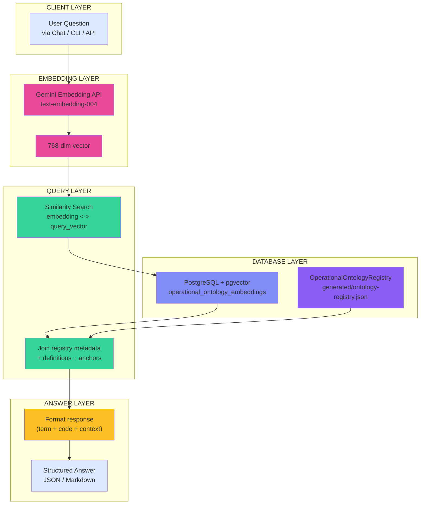
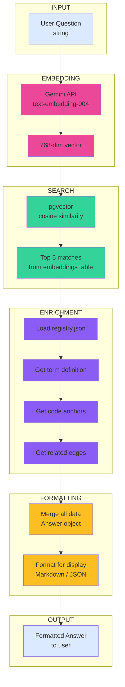

# Ontology Query System — From Questions to Answers

This document describes how to build an agent that answers questions about your codebase using the unified ontology registry and semantic search via pgvector.

**See Also:**
- `ARCHITECTURE_DIAGRAM.md` — Complete pipeline overview
- `IMPLEMENTATION_STATUS.md` — What's implemented vs. pending
- `README.md` — Getting started guide
- `docs/USAGE.md` — Developer tagging guide

---

## The Vision: Question → Answer Flow

```
┌──────────────────────────────────────────────────────────────┐
│                     USER ASKS QUESTION                        │
│          "How does kit matching work in the system?"          │
└──────────────────────────────────────────────────────────────┘
                              ↓
┌──────────────────────────────────────────────────────────────┐
│                   SEMANTIC EMBEDDING                          │
│   Take user question → embed via Gemini API                  │
│   → 768-dimensional vector                                    │
└──────────────────────────────────────────────────────────────┘
                              ↓
┌──────────────────────────────────────────────────────────────┐
│                  PGVECTOR SIMILARITY SEARCH                    │
│   Query: SELECT * FROM operational_ontology_embeddings       │
│           WHERE embedding <-> user_vector                    │
│           ORDER BY similarity LIMIT 5                         │
└──────────────────────────────────────────────────────────────┘
                              ↓
┌──────────────────────────────────────────────────────────────┐
│              REGISTRY LOOKUP & ENRICHMENT                      │
│   For each result:                                            │
│   ├─ Load term definition from registry                      │
│   ├─ Load code anchors (functions, classes, locations)       │
│   └─ Calculate relevance score                               │
└──────────────────────────────────────────────────────────────┘
                              ↓
┌──────────────────────────────────────────────────────────────┐
│                    FORMATTED ANSWER                           │
│                                                               │
│  **KitType** (Business Concept)                              │
│  "A collection of document templates that must all be        │
│   present for a folder to be considered complete."           │
│                                                               │
│  **Where it lives:**                                          │
│  • Class: domains/documents_validation/domain/kit.py:42      │
│  • Rule: domains/documents_validation/domain/                │
│          kit_matching.py:122 (evaluate_kit_completion)       │
│                                                               │
│  **Related:**                                                 │
│  • Enforces: KitCompletion                                   │
│  • Contains: DocumentTemplate                                │
│                                                               │
└──────────────────────────────────────────────────────────────┘
```

---

## The Architecture



---

## What Gets Embedded (Two Granularities)

### 1. **Dictionary Terms (Conceptual Anchors)**

Each business/system concept becomes one embedding:

```json
{
  "key": "KitType",
  "source_type": "term",
  "term": "KitType",
  "prefix": "biz",
  "text": "Term: KitType\nDescription: A collection of document templates...\nEdges: contains -> DocumentTemplate, enforces -> KitCompletion\nAliases: kit_type, template_collection, coleção de templates"
}
```

**Query:** "What templates are used?"
→ Matches `KitType` (contains DocumentTemplate)

### 2. **Code Anchors (Implementation Symbols)**

Each tagged function/class becomes one embedding:

```json
{
  "key": "evaluate_kit_completion",
  "source_type": "anchor",
  "term": "KitType",
  "taxonomy_type": "rule",
  "text": "Symbol: evaluate_kit_completion\nTerm: KitType\nType: rule\nFile: domains/documents_validation/domain/kit_matching.py:122\nDescription: Evaluate folder docs against active KitTypes using OR logic"
}
```

**Query:** "How does kit matching work?"
→ Matches `evaluate_kit_completion` function

**Combined:** Ask the question, get both the definition AND the implementation.

---

## Example Queries

### Query 1: Business Concept
```
Q: "What is a remessa?"
→ Searches embeddings for term definitions
→ Returns: DictionaryTerm(name="Remessa", description="...", anchors=[...])
→ Answer shows: Definition + code locations where it's implemented
```

### Query 2: Implementation Detail
```
Q: "How do we check if a kit is complete?"
→ Searches embeddings for functions/rules related to completion
→ Returns: CodeAnchor(symbol="evaluate_kit_completion", term="KitType", ...)
→ Answer shows: Function location + docstring + related dictionary term
```

### Query 3: Relationship Navigation
```
Q: "What does KitType contain?"
→ Searches embeddings, finds KitType term
→ Loads edges: contains -> DocumentTemplate, enforces -> KitCompletion
→ Answer shows: Concept + all related concepts + their implementations
```

---

## Implementation: Three Architectures

### **Option A: Python CLI Tool** (Simplest)

```python
# tools/semantic-index/query_cli.py
import sys
from tools.ontology.query_engine import QueryEngine

def main():
    question = " ".join(sys.argv[1:])
    engine = QueryEngine()
    answer = engine.query(question)
    print(answer.formatted())

if __name__ == "__main__":
    main()
```

**Usage:**
```bash
python -m tools.ontology.query_cli "How does kit matching work?"
```

**Pros:** Simple, no network overhead, runs locally
**Cons:** Only works from CLI

---

### **Option B: REST API** (Integration-friendly)

```python
# house_project/api/ontology_api.py
from fastapi import FastAPI
from tools.ontology.query_engine import QueryEngine

app = FastAPI()
engine = QueryEngine()

@app.get("/api/ontology/query")
def query(q: str):
    answer = engine.query(q)
    return answer.model_dump()  # JSON response
```

**Usage:**
```bash
curl "http://localhost:8000/api/ontology/query?q=How+does+kit+matching+work"
```

**Pros:** Can integrate with agents, web UI, other services
**Cons:** Requires running a server

---

### **Option C: Agent-Native** (Claude Direct)

```python
# Available as MCP tool or skill
def query_ontology(question: str) -> dict:
    """Query the ontology embeddings for semantic search."""
    engine = QueryEngine()
    return engine.query(question).model_dump()
```

Claude calls this directly, formats the answer for the user.

**Pros:** Seamless agent integration, no separate service
**Cons:** Requires MCP server running

---

## The QueryEngine Implementation

Pseudocode for what you need to build:

```python
class QueryEngine:
    def __init__(self):
        self.pg = PostgresConnection()
        self.registry = load_registry_json()
        self.gemini = GeminiClient()

    def query(self, user_question: str) -> Answer:
        # Step 1: Embed the question
        question_vector = self.gemini.embed(user_question)

        # Step 2: Search pgvector
        raw_results = self.pg.execute("""
            SELECT key, source_type, term, text, embedding
            FROM operational_ontology_embeddings
            ORDER BY embedding <-> %s::vector
            LIMIT 5
        """, (question_vector,))

        # Step 3: Enrich with registry metadata
        enriched = []
        for result in raw_results:
            term_data = self.registry.terms.get(result.term)
            enriched.append(Answer(
                term=result.term,
                definition=term_data.description,
                prefix=term_data.prefix,
                source_type=result.source_type,
                anchors=term_data.anchors,
                text=result.text
            ))

        # Step 4: Format and return
        return FormattedAnswer(enriched)

class Answer:
    term: str                          # "KitType"
    prefix: str                        # "biz"
    source_type: str                   # "term" or "anchor"
    definition: str                    # Dictionary description
    anchors: list[CodeAnchor]         # Where it's implemented
    text: str                          # Embedding source text

    def formatted(self) -> str:
        """Pretty-print for CLI/chat."""
        # Generate markdown answer with links
        pass
```

---

## Data Flow: Query → Results



---

## Setup Checklist

To make queries work:

- [ ] **Docker running:** `docker compose -f docker-compose.dev.yml up --build`
- [ ] **Database initialized:** `python tools/semantic-index/setup.py`
- [ ] **Registry built:** `python -m tools.ontology.cli extract`
- [ ] **Embeddings generated:** `python -m tools.ontology.cli embed`
- [ ] **pgvector table populated:** `SELECT COUNT(*) FROM operational_ontology_embeddings`
- [ ] **QueryEngine coded:** Build query layer (choose Option A/B/C)
- [ ] **Tested:** Run sample queries, verify results

---

## Success Criteria

A working query system should:

✅ Accept natural language questions
✅ Return relevant terms + definitions
✅ Show code locations (file + line + symbol)
✅ Display related concepts (edges)
✅ Rank results by semantic similarity
✅ Handle multi-word queries
✅ Return ~0.5s per query (pgvector is fast)

---

## Next Steps

1. **Choose your architecture** (CLI / API / Agent-native)
2. **Build QueryEngine** (implement the pseudocode above)
3. **Test with sample questions** (see "Example Queries" section)
4. **Integrate with your agent** (Claude skill / MCP tool)
5. **Monitor query performance** (pgvector should be <100ms per query)

Once this is live, you can answer **any** question about your codebase by combining semantic search with your dictionary definitions and code locations.
