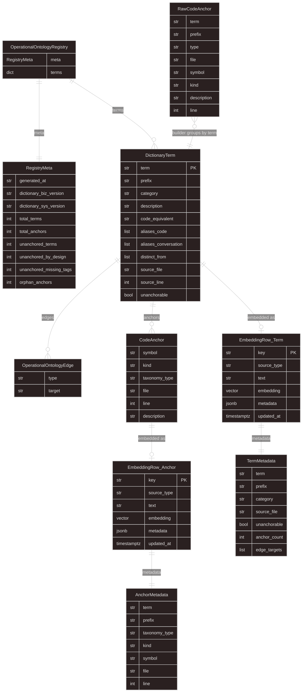

# Model Description: Extraction Pipeline

> Reference for every model used by `tools/semantic-index/`. Defines naming,
> purpose, fields, and relationships across the two ontology layers
> (operational and conceptual).

---

## Two Ontologies

The project maintains two ontology layers at different granularities.
They are complementary, not redundant.

| | Conceptual Ontology | Operational Ontology |
|---|---|---|
| **Granularity** | Document (`.md` file) | Term / code symbol |
| **Source** | Vault frontmatter + `## Connections` | Dictionaries + `@biz`/`@sys` tags |
| **Edge types** | `derives-from`, `implements`, `contradicts` | `enforces`, `contains`, `produced-by` |
| **Storage** | `conceptual_ontology_nodes` + `conceptual_ontology_edges` + `conceptual_ontology_embeddings` | `operational_ontology_terms` + `operational_ontology_anchors` + `operational_ontology_edges` + `operational_ontology_embeddings` |
| **Consumers** | Information Keeper, Bayesian Agent | Tag validator, coverage report, semantic code search |
| **Implementation** | Phase 4 (deferred) | Phase 2-3 (2026-04-07+) |

The link between them: `DictionaryTerm.source_file` points to a dictionary
markdown file, which *would be* a node in the conceptual graph (`ontology_nodes.path`).

---

> **Implementation Note (2026-04-07):** Phase 2-3 focuses on **Operational Ontology only**. This gives agents immediate code queryability and prevents code/dictionary drift. Conceptual Ontology (vault graph reasoning) is deferred to Phase 4 with the Bayesian Agent. All models are defined below for reference, but Phase 2-3 builds the 4 operational tables only; the 3 conceptual tables are postponed.

---

## Operational Ontology Models

These models live in `tools/semantic-index/models.py` (Pydantic) and
`tools/semantic-index/extractors/tag_scanner.py` (dataclass).

### OperationalOntologyRegistry

The complete pipeline output. Serialized to `generated/ontology-registry.json`
as a CI artifact (not committed to the repo). Merges two sources (dictionaries
+ code tags) into one queryable structure.

```python
class OperationalOntologyRegistry(BaseModel):
    meta: RegistryMeta
    terms: dict[str, DictionaryTerm]  # keyed by canonical term name
```

### RegistryMeta

Aggregate metrics for one pipeline run. The "header" of the registry output.
Used by the coverage report and CI validation.

```python
class RegistryMeta(BaseModel):
    generated_at: str                # ISO 8601 timestamp
    dictionary_biz_version: str      # from biz dictionary frontmatter
    dictionary_sys_version: str      # from sys dictionary frontmatter
    total_terms: int
    total_anchors: int
    unanchored_terms: int            # terms with zero code anchors
    unanchored_by_design: int        # abstract concepts (unanchorable=True)
    unanchored_missing_tags: int     # should be tagged but aren't yet
    orphan_anchors: int              # tags referencing unknown terms (must be 0)
```

### DictionaryTerm

A single term from the dictionary, enriched with its code anchors after the
builder cross-references scanner output. This is the central data structure
of the pipeline — every term carries both its definition (from Markdown) and
its code bindings (from `@biz`/`@sys` tags).

```python
class DictionaryTerm(BaseModel):
    term: str                        # canonical name (H3 heading)
    prefix: str                      # "biz" or "sys"
    category: str                    # H2 section in the dictionary
    description: str                 # prose description
    code_equivalent: str | None      # primary code symbol name
    aliases_code: list[str]          # known aliases in codebase
    aliases_conversation: list[str]  # known aliases in conversation/docs
    edges: list[OperationalOntologyEdge]
    distinct_from: list[str]         # terms this is explicitly not
    source_file: str                 # dictionary file path
    source_line: int                 # line number of H3 heading
    unanchorable: bool = False       # true for abstract concepts with no taggable symbol
    anchors: list[CodeAnchor]        # populated by builder after cross-referencing
```

### OperationalOntologyEdge

A relationship between two dictionary terms. Declared in the dictionary
Markdown under the `Edges:` bullet. These edges exist at the **term level**
(operational ontology), not the document level (conceptual ontology).

Edges come from the dictionary only — no automatic inference from code.
Code-level call relationships are captured via GitNexus in a future phase.

```python
class OperationalOntologyEdge(BaseModel):
    type: str      # "enforces", "contains", "produced-by", etc.
    target: str    # target term name in the dictionary
```

### CodeAnchor

A code symbol tagged with `@biz` or `@sys` that has been normalized and
attached to its parent `DictionaryTerm` by the builder. This is the
**registry-side** representation — `term` and `prefix` are not stored here
because they are already on the parent `DictionaryTerm`.

```python
class CodeAnchor(BaseModel):
    symbol: str        # function/class/method name
    kind: str          # "function", "class", "method" (AST-derived)
    taxonomy_type: str # "rule", "entity", "operation", etc. (from @biz/@sys tag)
    file: str          # relative file path from repo root
    line: int          # line number in source file
    description: str   # docstring description (without tag lines)
```

### RawCodeAnchor

The tag scanner's raw output — one flat record per tagged symbol. Carries
`term` and `prefix` because the scanner doesn't know which `DictionaryTerm`
it belongs to yet. The builder groups these by `term`, attaches each to its
`DictionaryTerm`, and normalizes them into `CodeAnchor` objects (dropping the
now-redundant `term`/`prefix` and renaming `type` to `taxonomy_type`).

This is a Python `dataclass`, not Pydantic — the scanner is a lightweight
AST tool that runs in pre-commit hooks and should not depend on Pydantic.

```python
@dataclass
class RawCodeAnchor:
    term: str          # "KitType" — used by builder for grouping
    prefix: str        # "biz" — used by builder for grouping
    type: str          # "rule" — becomes CodeAnchor.taxonomy_type
    file: str
    symbol: str        # "evaluate_kit_completion"
    kind: str          # "function"
    description: str
    line: int
```

### LintResult

Structured output from the dictionary linter. Each instance represents one
validation finding (error or warning) at a specific location in a dictionary
file.

```python
@dataclass
class LintResult:
    file: str       # dictionary file path
    line: int       # line number of the problem
    level: str      # "error" or "warning"
    message: str    # human-readable description
```

---

## Postgres Tables

Both ontologies live in the same Postgres database with fully symmetric
naming. Every table is prefixed with its ontology layer.

### Conceptual Ontology (document-level, vault graph)

Defined in `discovery-data-foundations.md`. Implemented in `setup.py`.

| Table | Purpose |
|-------|---------|
| `conceptual_ontology_nodes` | One row per vault `.md` file. Columns mirror YAML frontmatter fields. Materialized cache — always populated by `sync_vault_node(path)`, never written directly. |
| `conceptual_ontology_edges` | One directed edge between two vault documents, parsed from `## Connections` tables. Stores both declared edges and computed inverse rows for bidirectional queries. |
| `conceptual_ontology_embeddings` | Vectorized representations of vault documents enriched with graph context (neighboring node titles, document level/type). Separate from the nodes table to keep it a pure frontmatter cache. |

### Operational Ontology (term/code-level, extraction pipeline)

Designed in this document. Operational tables implemented in `setup.py`. Embedding tables implemented as Django models in `tools/ontology_app/models.py` (Django app label: `ontology`), migrated via `tools/ontology_app/migrations/0001_initial.py`.

| Table | Purpose | Implementation |
|-------|---------|----------------|
| `operational_ontology_terms` | One row per dictionary term. Stores the full definition: name, prefix, category, description, code equivalent, aliases, `unanchorable` flag. FK target for anchors and edges. | `setup.py` SQL DDL |
| `operational_ontology_anchors` | One row per tagged code symbol. FK → `operational_ontology_terms(term)`. Stores symbol name, kind, `taxonomy_type`, file path, line number. Unique constraint on `(file, symbol)`. | `setup.py` SQL DDL |
| `operational_ontology_edges` | Term-to-term edges from the dictionary's `Edges:` bullet. FKs on both `source_term` and `target_term` → `operational_ontology_terms(term)`. | `setup.py` SQL DDL |
| `embedding_term` | 768-dim Gemini vectors for each dictionary term. Composed text from description, aliases, edges. Used for semantic term search. | `tools/ontology_app/models.py` → Django migration |
| `embedding_anchor` | 768-dim Gemini vectors for each tagged code symbol. Composed text from symbol, location, term, description. Used for semantic code discovery. | `tools/ontology_app/models.py` → Django migration |

### Shared

| Table | Purpose |
|-------|---------|
| `ontology_events` | Immutable event log for both ontologies. Records every mutation (promotions, downgrades, contradictions, creations). Foundation for agent observability and Bayesian confidence tracking. |

### Cross-ontology link

`DictionaryTerm.source_file` (in the operational ontology) points to a
dictionary Markdown path. That same path is a node in the conceptual graph
(`conceptual_ontology_nodes.path`). An agent finding a term in the
operational graph follows `source_file` to reach the vault node for
higher-level context (premises, constitutions, decisions).

---

## Edge Vocabulary

Edges declared on `OperationalOntologyEdge.type` must use verbs from the
approved vocabulary (domain-tagging-constitution Rule 6).

### Forward / Inverse (12 base pairs)

| Forward | Inverse | Connects |
|---------|---------|----------|
| `performs` | `performed-by` | Entity → Operation |
| `produces` | `produced-by` | Operation → Event |
| `enforces` | `enforced-by` | Rule → Operation |
| `calculates` | `calculated-by` | Calculation → Operation |
| `transitions` | `transitioned-by` | Event → State Machine |
| `exposes` | `exposed-by` | Interface → Operation/Query |
| `orchestrates` | `orchestrated-by` | Workflow → Operation[] |
| `applies` | `applied-by` | Policy → Operation |
| `maps` | `mapped-by` | Mapping → Entity/Interface |
| `contains` | `contained-in` | Entity → Value Object |
| `queries` | `queried-by` | Query → Entity |
| `emits` | `emitted-by` | Entity → Event |

### Additional (practice-derived, formally approved)

Four edges extend the base 12. All others are rejected by the linter.

| Forward | Inverse | Meaning |
|---------|---------|---------|
| `governs` | `governed-by` | State or status controls behaviour of another entity |
| `matches` | `matched-by` | Term identifies or matches against another |
| `implements` | `implemented-by` | Concrete entity is realization of abstract concept |
| `derives` | `derived-from` | Template/definition from which another is generated |

Source of truth: `tools/semantic-index/taxonomy.py` → `ADDITIONAL_EDGES`

---

## Embedding Metadata (JSONB)

The `operational_ontology_embeddings` table has a `metadata JSONB` column
for structured filtering alongside semantic search. Two shapes, one per
`source_type`.

### `operational_ontology_embeddings` table

```sql
CREATE TABLE operational_ontology_embeddings (
    key         TEXT PRIMARY KEY,      -- "term:KitType" or "anchor:EligibilityFilter:run_filters"
    source_type TEXT NOT NULL,         -- "dictionary_term" or "code_anchor"
    text        TEXT NOT NULL,         -- composed text that was embedded
    embedding   vector(768),           -- Gemini text-embedding-004
    metadata    JSONB,                 -- structured sidecar (see below)
    updated_at  TIMESTAMPTZ DEFAULT NOW()
);

-- GIN index for efficient JSONB filtering
CREATE INDEX idx_op_embeddings_metadata ON operational_ontology_embeddings
    USING GIN (metadata);
```

### Metadata for `source_type: "dictionary_term"`

```json
{
  "term": "EligibilityFilter",
  "prefix": "biz",
  "category": "Rules & Validation",
  "source_file": "docs/vault/dictionary-business.md",
  "unanchorable": false,
  "anchor_count": 3,
  "edge_targets": ["Remessa", "FilterResult"],
  "aliases_code": ["eligibility_criteria", "filter_criteria"],
  "aliases_conversation": ["filtro de elegibilidade", "filter gate"]
}
```

| Field | Type | Purpose |
|-------|------|---------|
| `term` | `string` | Canonical term name |
| `prefix` | `string` | `"biz"` or `"sys"` |
| `category` | `string` | H2 section — filter by domain area |
| `source_file` | `string` | Links to vault graph (`conceptual_ontology_nodes.path`) |
| `unanchorable` | `boolean` | Agents skip abstract terms when looking for code |
| `anchor_count` | `number` | Quick coverage check without joins |
| `edge_targets` | `string[]` | Graph traversal: `WHERE metadata->'edge_targets' ? 'Remessa'` |
| `aliases_code` | `string[]` | Human-readable display of codebase aliases |
| `aliases_conversation` | `string[]` | Human-readable display of conversation aliases |

### Metadata for `source_type: "code_anchor"`

```json
{
  "term": "EligibilityFilter",
  "prefix": "biz",
  "taxonomy_type": "rule",
  "kind": "function",
  "symbol": "run_filters",
  "file": "domains/aquisicao/use_cases/approve_remessa.py",
  "line": 42,
  "tag_raw": "@biz: EligibilityFilter | type: rule"
}
```

| Field | Type | Purpose |
|-------|------|---------|
| `term` | `string` | Parent dictionary term |
| `prefix` | `string` | `"biz"` or `"sys"` |
| `taxonomy_type` | `string` | The killer filter: `"rule"`, `"entity"`, `"operation"`, etc. |
| `kind` | `string` | AST-derived: `"function"`, `"class"`, `"method"` |
| `symbol` | `string` | Function/class/method name |
| `file` | `string` | Relative file path — agent jumps to code |
| `line` | `number` | Line number in source |
| `tag_raw` | `string` | Reconstructed from fields: `@{prefix}: {term} \| type: {type}` |

### Example queries

```sql
-- "What rules exist related to eligibility?"
SELECT key, text, 1 - (embedding <=> $query_vec) AS similarity
FROM operational_ontology_embeddings
WHERE metadata->>'taxonomy_type' = 'rule'
ORDER BY embedding <=> $query_vec
LIMIT 5;

-- "What business concepts live in the aquisicao domain?"
SELECT key, text
FROM operational_ontology_embeddings
WHERE metadata->>'prefix' = 'biz'
  AND metadata->>'file' LIKE 'domains/aquisicao/%'
ORDER BY embedding <=> $query_vec
LIMIT 10;

-- "What connects to Remessa?" (graph hop from embedding table)
SELECT key, text
FROM operational_ontology_embeddings
WHERE metadata->'edge_targets' ? 'Remessa';
```

---

## Data Flow

```
tag_scanner.scan_file()  -->  RawCodeAnchor (dataclass, 8 fields)
                                    |
                                    v
registry/builder.py      -->  groups by term, normalizes to CodeAnchor (Pydantic, 6 fields)
                                    |
                                    v
DictionaryTerm.anchors   -->  list[CodeAnchor]  (term + prefix on parent, not on anchor)
```

---

## Entity Relationship Diagram



### Reading the diagram

The ER diagram has four layers. Read top-to-bottom:

**1. Registry layer (pipeline output)**

`OperationalOntologyRegistry` is the top-level container — one per pipeline
run. It holds a `RegistryMeta` (aggregate metrics: how many terms, anchors,
orphans) and a dictionary of `DictionaryTerm` entries keyed by canonical name.
This is serialized to `generated/ontology-registry.json` as a CI artifact.

**2. Term layer (dictionary + code)**

Each `DictionaryTerm` is the central node. It carries the definition from
the Markdown dictionary (description, aliases, edges, category) and a list of
`CodeAnchor` objects — the tagged symbols in the codebase that bind to this
concept. A term like `EligibilityFilter` might have 3 anchors: the class
itself (entity), a validation function (rule), and a query function (query).

`OperationalOntologyEdge` is a directed relationship between two terms
(e.g., `EligibilityFilter --enforces--> Remessa`). Edges come from the
dictionary only — they are declared in the `Edges:` bullet of each entry.

**3. Scanner layer (raw extraction)**

`RawCodeAnchor` is the tag scanner's output — one flat record per `@biz`/`@sys`
tag found in the codebase. It carries `term` and `prefix` because the scanner
doesn't know which `DictionaryTerm` it belongs to yet. The registry builder
groups these by `term`, attaches each to its parent `DictionaryTerm`, and
normalizes them into `CodeAnchor` objects (dropping the now-redundant
`term`/`prefix` and renaming `type` → `taxonomy_type`).

**4. Embedding layer (pgvector storage)**

Each `DictionaryTerm` and each `CodeAnchor` can produce an embedding row in
`operational_ontology_embeddings`. Both rows share the same Postgres table
but have different `source_type` values (`dictionary_term` vs `code_anchor`)
and different `metadata` shapes:

- `TermMetadata` — carries `category`, `aliases_code`, `aliases_conversation`,
  `edge_targets`, `anchor_count`. Enables queries like "show me all concepts
  in Rules & Validation" or "what connects to Remessa?"
- `AnchorMetadata` — carries `taxonomy_type`, `file`, `line`, `symbol`,
  `tag_raw`. Enables queries like "find all rules" or "what business code
  lives in the aquisicao domain?"

**Cross-ontology link** (dashed line at the bottom): `DictionaryTerm.source_file`
points to a dictionary Markdown path (e.g., `docs/vault/dictionary-business.md`).
That same path is a node in the conceptual ontology
(`conceptual_ontology_nodes.path`). This is how an agent navigates from
a code-level term to the document-level vault graph for higher-level context.

---

## Connections

| Document | Edge | Description |
|----------|------|-------------|
| `discovery-data-foundations.md` | `depends-on` | Prescribes the conceptual ontology tables and embedding architecture |
| `discovery-extraction-pipeline.md` | `depends-on` | Designs the extractors and pipeline that produce the operational models |
| `implementation-plan-extraction-pipeline.md` | `implements` | Execution plan references these model names |
| `tools/semantic-index/models.py` | `implements` | Pydantic definitions of the operational models |
| `tools/semantic-index/extractors/tag_scanner.py` | `implements` | RawCodeAnchor dataclass definition |
| `discovery-pipeline-operationalization.md` | `referenced-by` | Build plan references models and metadata schemas |
| `docs/vault/constitution/domain-tagging-constitution.md` | `governed-by` | Edge vocabulary (Rule 6) and taxonomy types (Rule 5) |
